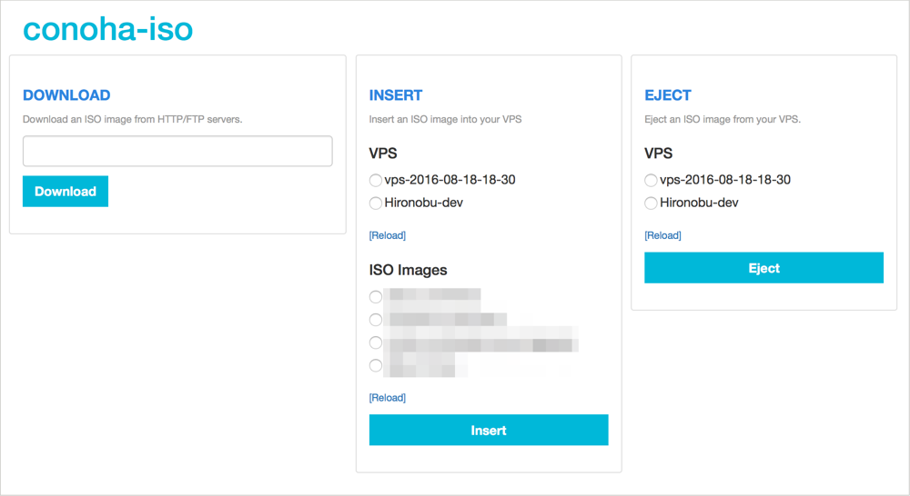

[](LICENSE)  [](https://travis-ci.org/hironobu-s/conoha-iso) [](https://codebeat.co/projects/github-com-hironobu-s-conoha-iso)

# ConoHa ISO

*ConoHa ISO* is a simple tool for managing the ISO images on [ConoHa API](https://www.conoha.jp/).

## Install

Please download the executable files as follows.

**Mac OSX**

```bash
curl -sL https://github.com/hironobu-s/conoha-iso/releases/download/current/conoha-iso-osx.amd64.gz | zcat > conoha-iso && chmod +x ./conoha-iso
```

**Linux(amd64)**

```bash
curl -sL https://github.com/hironobu-s/conoha-iso/releases/download/current/conoha-iso-linux.amd64.gz | zcat > conoha-iso && chmod +x ./conoha-iso
```

**Windows(amd64)**

[ZIP file](https://github.com/hironobu-s/conoha-iso/releases/download/current/conoha-iso.amd64.zip)


## Run in Docker

You can also run conoha-iso in Docker. Using [docker-conoha-iso.sh](https://github.com/hironobu-s/conoha-iso/blob/master/docker-conoha-iso.sh) script may be useful.

(See https://hub.docker.com/r/hironobu/conoha-iso/)

## Introduction

You need to provide some authentication informations, which are API-Username, API-Password, Tenant-ID and Region to run conoha-iso. These are on the ConoHa control-panel. The region should be "tyo1", "sin1", or "sjc1".

**Via command-line arguments**

Use -u, -p, -n, -t, -r options to authenticate. Tenant-Name and Tenant-ID are specified either. if Region is not set, it will be used "tyo1".

Use tenant name
```bash
./conoha-iso list -u [API-Username] -p [API-Password] -n [Tenant-Name] -r [Region]
```

Use tenant id
```bash
./conoha-iso list -u [API-Username] -p [API-Password] -t [Tenant-ID] -r [Region]
```

**Via environment variables**

Use environment variables, like OS_USERNAME, OS_PASSWORD, OS_TENANT_NAME, OS_TENANT_ID, OS_AUTH_URL and OS_REGION.

In bash/sh

```bash
export OS_USERNAME=[API-Username]
export OS_PASSWORD=[API-Password]
export OS_TENANT_NAME=[Tenant-Name]
export OS_AUTH_URL=[Identity Endpoint]
export OS_REGION_NAME=[Region]
```

## How to use

conoha-iso has several sub-commands.

### list

Display ISO images. 

```bash
./conoha-iso download -i http://stable.release.core-os.net/amd64-usr/current/coreos_production_iso_image.iso
```

Output:

```
# ./conoha-iso list
[Image1]
Name:  alpine-mini-3.2.0-x86_64.iso
Url:   http://wiki.alpinelinux.org/cgi-bin/dl.cgi/v3.2/releases/x86_64/alpine-mini-3.2.0-x86_64.iso
Path:  /mnt/isos/repos/tenant_iso_data/6150e7c42bab40c59db53d415629841f/alpine-mini-3.2.0-x86_64.iso
Ctime: Wed May 27 04:30:45 2015
Size:  92329984

[Image2]
Name:  coreos_production_iso_image.iso
Url:   http://beta.release.core-os.net/amd64-usr/current/coreos_production_iso_image.iso
Path:  /mnt/isos/repos/tenant_iso_data/6150e7c42bab40c59db53d415629841f/coreos_production_iso_image.iso
Ctime: Thu May 28 02:03:18 2015
Size:  178257920
```

### insert

Insert an ISO image to your VPS. If you run it, The menu for selecting ISO image and VPS will be displayed.

```
# ./conoha-iso insert
[1] ***-***-***-***
[2] ***-***-***-***
Please select VPS no. [1-2]: 1

[1] alpine-mini-3.2.0-x86_64.iso
[2] coreos_production_iso_image.iso
Please select ISO no. [1-2]: 2
INFO[0039] ISO file was inserted and changed boot device.
```

### eject

Eject an ISO image from your VPS.


```
# ./conoha-iso eject
[1] ***-***-***-***
[2] ***-***-***-***
Please select VPS no. [1-2]: 1
INFO[0001] ISO file was ejected.
```

### server

Launch web console to manage ISO image and VPS. You may run the web browser and aceess the URL displayed.

```
$ ./conoha-iso server
Running on http://127.0.0.1:6543/
```

It can specify servers's listen-address and listen-port by using **-l** option, 

```
$ ./conoha-iso server -l 0.0.0.0:10000
Running on http://0.0.0.0:10000/
```



## Help

All sub-commands accept -h option for displaying the descriptions.

```bash
./conoha-iso -h
```

## License

MIT
